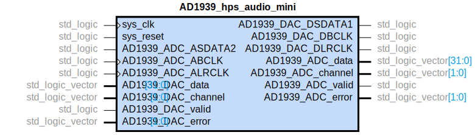
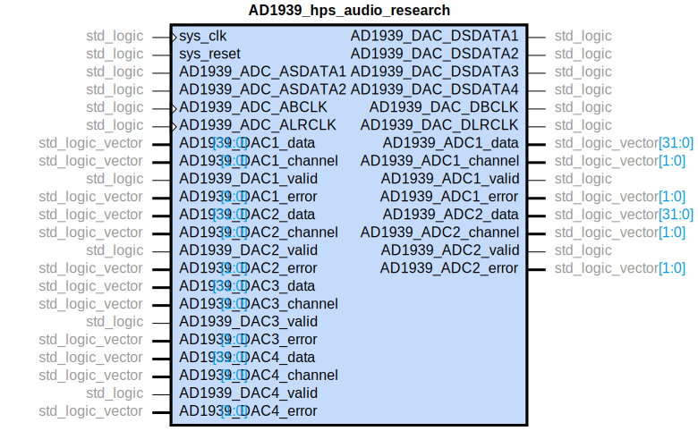

# AD1939 Codec Controller
The AD1939 component controls the [Analog Devices AD1939 codec](https://www.analog.com/en/products/ad1939.html#product-overview). The controller comprises a VHDL component that handles audio data transmission, and a device driver that sets codec volumes. 

## Codec Configuration
- I2S-justified stereo serial mode
- ADC is set as master
- DAC is set as slave
- 24 bit words

For information on the codec, see its [datasheet](https://www.analog.com/media/en/technical-documentation/data-sheets/AD1939.pdf)


## VHDL Controller
The VHDL controller converts I2S data from the codec into an [Avalon Streaming Interface](https://www.intel.com/content/www/us/en/programmable/documentation/nik1412467993397.html#nik1412467963376), and vice versa when sending data back to the codec. The 24-bit data coming from the codec gets converted into s32.28 [fixed-point](https://en.wikipedia.org/wiki/Fixed-point_arithmetic) data. 

There are two AD1939 controllers: one for the Audio Mini, and one for the Audio Blade.

### Audio Mini
The Audio Mini only uses 1 ADC and 1 DAC on the codec. 



### Audio Blade
The Audio Blade uses 2 ADC outputs and 4 DAC inputs on the codec. 



## Driver Interface
The device driver has the following attributes exposed in [sysfs](https://www.kernel.org/doc/html/latest/filesystems/sysfs.html):
- `sample_frequency`: read/write the codec's sample frequency
- `dac1_left_volume`: read/write the left channel volume for DAC 1
- `dac2_left_volume`: read/write the left channel volume for DAC 2
- `dac3_left_volume`: read/write the left channel volume for DAC 3
- `dac4_left_volume`: read/write the left channel volume for DAC 4
- `dac1_right_volume`: read/write the right channel volume for DAC 1
- `dac2_right_volume`: read/write the right channel volume for DAC 2
- `dac3_right_volume`: read/write the right channel volume for DAC 3
- `dac4_right_volume`: read/write the right channel volume for DAC 4

The volume attributes are specified as negative numbers in decibels. 

### Example Usage
Set the left and right volume of DAC1 to -10 dB:
```bash
echo -10 > /sys/class/fe_AD1939_248/fe_AD1949_248/dac1_left_volume
echo -10 > /sys/class/fe_AD1939_248/fe_AD1949_248/dac1_right_volume
```
